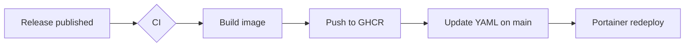

# MDViewer Feature Tour

This document exists to **show off** what the viewer renders. Everything above this
line (between the `---` fences) is *frontmatter* and should appear as a **meta card**,
not as raw text. Open the sidebar, use search, and try the buttons while you read.

> [!TIP] How to review
> Try each section below. The **Contents** panel on the right is auto-generated from
> the headings — click around. Then hit the **copy-link** button in the top bar and
> paste the URL in a new tab to confirm deep-links work.

---

## 1. Text formatting

Regular text with **bold**, *italic*, ***bold italic***, ~~strikethrough~~,
`inline code`, and a [normal link](https://example.com) plus an
[anchor link](#4-math-katex) that jumps within the page.

- Unordered list item
- Another item
  - Nested item
  - Nested item two
- Back to top level

1. Ordered item one
2. Ordered item two
3. Ordered item three

Task list (checkboxes render read-only):

- [x] Ship Phase 0 (live watch, deep links, search snippets)
- [x] Ship Phase 1 slice 1 (frontmatter, math, callouts)
- [ ] Footnotes, wikilinks, backlinks (coming next)

---

## 2. Callouts (GFM alerts)

Each blockquote starting with `> [!TYPE]` becomes a colored callout:

> [!NOTE]
> This is a note. Useful for general information.

> [!TIP] Custom title works too
> You can add your own title after the type.

> [!IMPORTANT]
> Something worth emphasising.

> [!WARNING]
> Be careful with this.

> [!CAUTION]
> The strongest warning level.

And a plain blockquote (no `[!type]`) still renders as a normal quote:

> "Simplicity is the ultimate sophistication." — not a callout, just a quote.

---

## 3. Code blocks & syntax highlighting

Hover a code block to reveal the **Copy** button.

```js
// JavaScript
function greet(name) {
  return `Hello, ${name}!`;
}
console.log(greet('MDViewer'));
```

```python
# Python
def fib(n):
    a, b = 0, 1
    for _ in range(n):
        a, b = b, a + b
    return a
```

Code fences are **math-safe** — the `$x$` and `$$y$$` below must stay literal,
NOT render as math:

```
plain code with $x$ and $$y$$ should remain untouched
```

---

## 4. Math (KaTeX)

Inline math renders in a sentence: the mass–energy relation is $E = mc^2$, and the
golden ratio is $\varphi = \frac{1 + \sqrt{5}}{2}$.

Currency is **not** treated as math — prices like $5 and $10 stay as plain text.

Display math (block) is centered on its own line:

$$
\int_{0}^{\infty} e^{-x^2}\,dx = \frac{\sqrt{\pi}}{2}
$$

$$
\begin{aligned}
\nabla \cdot \mathbf{E} &= \frac{\rho}{\varepsilon_0} \\
\nabla \cdot \mathbf{B} &= 0
\end{aligned}
$$

---

## 5. Tables

| Feature        | Phase | Status |
|----------------|:-----:|--------|
| Live watch/SSE |   0   | ✅ done |
| Deep links     |   0   | ✅ done |
| Search snippets|   0   | ✅ done |
| Frontmatter    |   1   | ✅ done |
| KaTeX math     |   1   | ✅ done |
| Callouts       |   1   | ✅ done |
| Wikilinks      |   1   | ⬜ next |

---

## 6. Mermaid diagrams



---

## 7. Search & live-reload test

Search for the unique word **xylophone** (top bar, or press `Ctrl/Cmd+K`) — this
document should appear with a highlighted snippet. Open it from the results and the
match is highlighted in-page and scrolled into view.

To see **live reload**: with this file open, edit `demo/feature-tour.md` on disk
(change this sentence) and save — the page refreshes automatically via SSE.

---

## 8. Deep-link & theme

- Click the **link icon** in the top bar to copy a shareable URL to this exact file.
- Toggle the **theme** button — the whole UI, code theme, and diagrams switch between
  the Material 3 light and dark schemes.

That's the tour. See `guide/extras.md` in the sidebar for a second file (handy for
testing the tree, cross-file search, and navigation).
